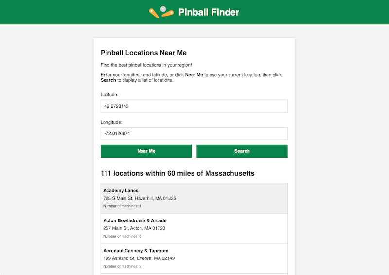

# Pinball Locations Near Me

Find nearby pinball locations using the [Pinball Map API](https://pinballmap.com/api/v1/docs). Written in vanilla JavaScript with a Node-Express router.

## Features
- "Near Me" button uses browser geolocation to auto-fill user's latitude and longitude coordinates.
- "Search" button populates a list of nearby pinball locations.
- Input validation and HTML sanitization (XSS).
- Client and server error handling.
- Responsive UI state.
- No build step required.
- Optimized for accessibility and SEO.

## Requirements

- Node.js (see [.nvmrc](.nvmrc))

## Getting Started

```sh
# Install Node packages
npm install
# Start Express server
npm start
```

## Example


